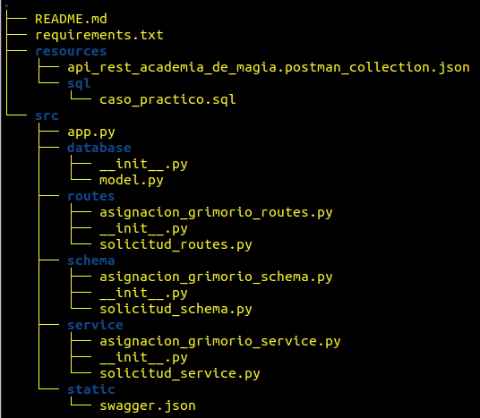
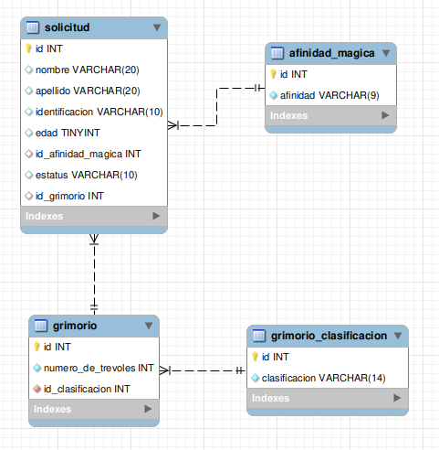
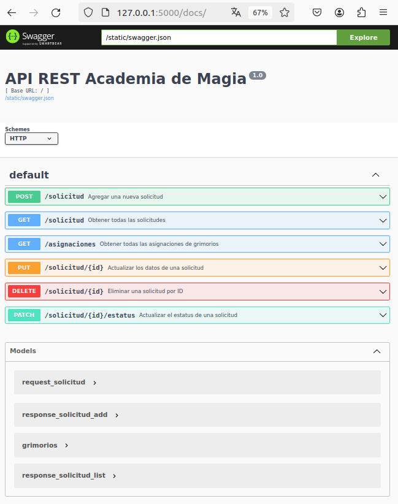

# api_rest_academia_de_magia
Este repositorio contiene el API REST para la academia de magia, que permite el registro de las solicitudes de estudiantes.

## Tabla de contenidos
- [Nombre del proyecto](#nombre-del-proyecto)
- [Instalación](#instalación)
- [Documentación](#documentación)

## Instalación
1) Clonar el repositorio dentro de tu workspace
2) Estructura del proyecto
   

    
  

   
4) Exportar la base de datos de la aplicacion, el archivo de importación se encuentra dentro de la carpeta ./resources/sql, en el directorio raiz de la aplicacion, y se llama caso_practico.sql, la base de datos tiene el mismo nombre. La version del SGBD donde se desarrollo fue MySQL Community Server 8.3.0. El diagrama entidad/relacion finalmente queda de la siguiente forma:
    

      
    

6) Instalar las dependencias necesarias para correr la aplicación, para esta tarea sera necesario que abras una terminal y realices los siguientes pasos:
   - Con el comando cd, posicionate dentro de la carpeta del proyecto que acabas de clonar (api_rest_academia_de_magia).
   - A continuación instalaremos las dependencias empleadas para la construcción del proyecto, esto lo hacemos con el siguiente comando:
             pip install -r requirements.txt.
   - Una vez terminada la instalación de las dependencias, validamos con el comando: pip freeze.
     
7) Modificar los valores de conexion a tu SGBD, la cadena de conexión se encuentra en el archivo app.py. Este archivo se encuentra dentro de la carpeta src.
   
8) Ejecutar la aplicación, para esto en una terminal, nos posicionamos dentro del directorio src, y capturamos la siguiente instrucción: python3 app.py, damos enter y el API REST quedara funcionando en la dirección: http://127.0.0.1:5000/docs/
  
10) Es posible importar la colección para validar los diferentes recursos del API desde POSTMAN, el archivo de respaldo se encuentra en ./resources/api_rest_academia_de_magia.postman_collection.json

## Documentación

La documentación de los diferentes recursos del API, así como los Request y Response los encontraras en la dirección: http://127.0.0.1:5000/docs/
 

    
  

   
